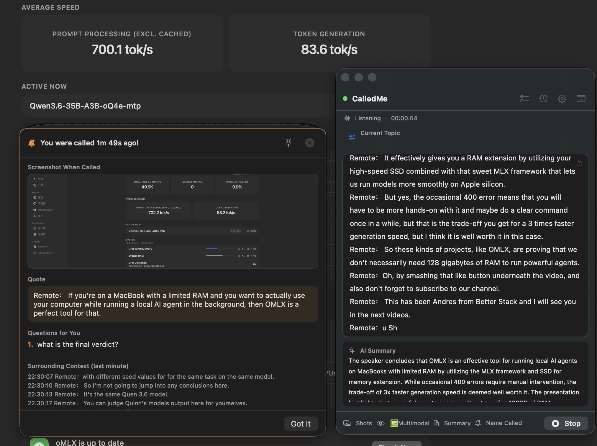
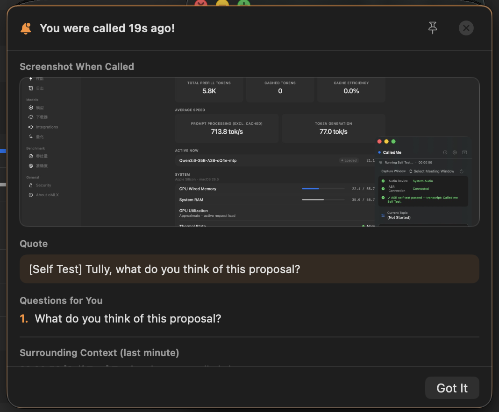
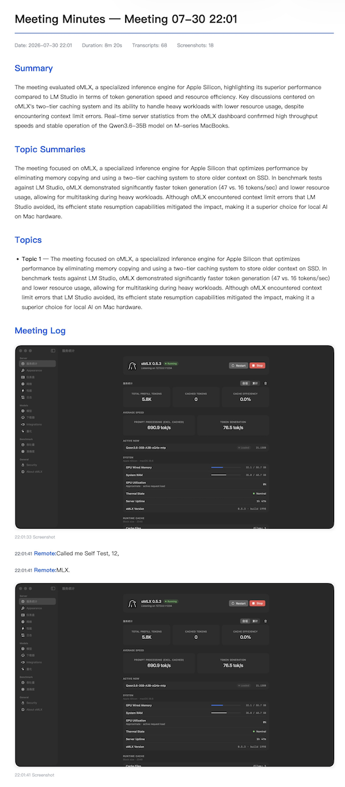
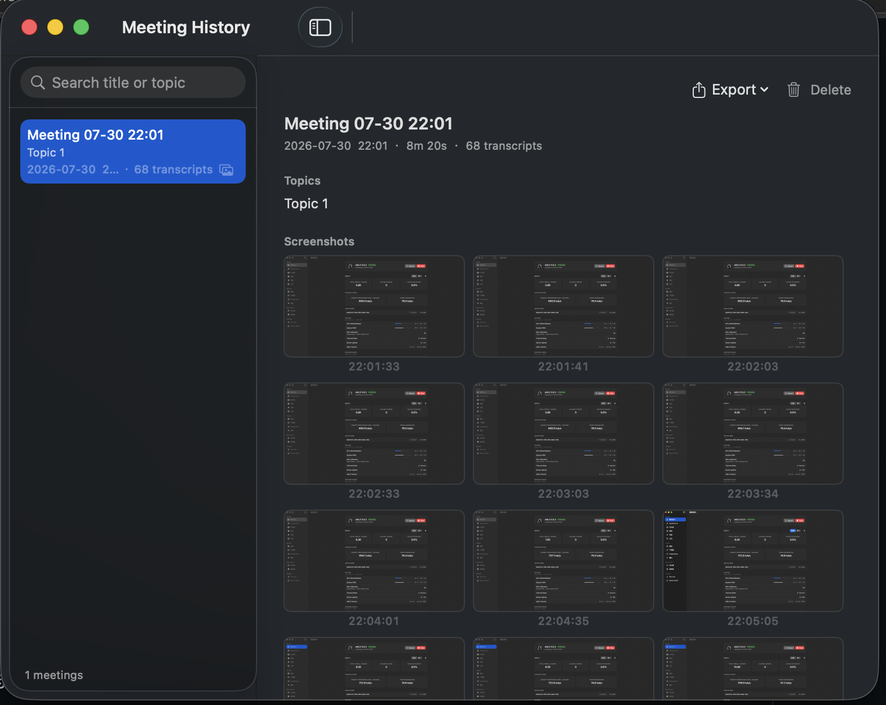

# CalledMe

[中文](README.md) | **English**

**When someone calls your name in a meeting, CalledMe alerts you right away.** — A native macOS AI meeting assistant: on-device live transcription · instant name call-out alerts · meeting minutes with screenshots · runs fully offline

<p>
  
  
  
  
  
</p>



---

## Why CalledMe

Ever been in an online meeting, half-listening while replying to messages, when suddenly someone says your name — "Wei, what do you think of this proposal?" — and you have no idea what was just discussed?

CalledMe is built for exactly that moment:

1. **It's always listening** — system audio is transcribed to text in real time, entirely on your Mac
2. **It knows who you are** — when someone calls your name (even a homophone misrecognition), a popup alerts you within 0.5 seconds
3. **It catches you up** — the popup includes an instant screenshot, the exact sentence, the previous 8 lines of conversation, and the AI-extracted "questions thrown at you"
4. **It writes the minutes too** — after the meeting, generate summaries, decisions and action items in one click, exported as Markdown / HTML / TXT

## Screenshots

| Name call-out alert | AI quick summary |
|:---:|:---:|
|  |  |
| Popup + instant screenshot + context + question extraction | Key points / decisions / action items in one click |

| Live transcription floating window | Meeting history & export |
|:---:|:---:|
|  |  |
| Automatic topic tracking, live scrolling transcript | Full archive, three export formats |

## Features

### 🎙️ Live Speech Transcription (100% On-Device)
- Uses the new `SpeechAnalyzer / SpeechTranscriber` framework on macOS 26, with automatic fallback to on-device `SFSpeechRecognizer` on macOS 15–25
- Raw audio **never leaves your Mac** — no network required, no recognition quota
- Bilingual UI (中文 / English); recognition language follows the UI

### 🗣️ Dual-Track Speaker Identification
- **Independent mic and system-audio tracks**: your speech is attributed with 100% accuracy (shown under your name); remote participants go to the "other party" track — no voiceprint models needed, physical channel isolation can't mix people up
- **Speakerphone echo cancellation**: OS-level AEC on mic capture plus cross-track text dedup — on speakers, the remote voice is never re-captured by the mic and shown as your own words
- **Automatic naming at meeting end**: weighted voting correlates transcript timestamps with "currently speaking" names OCR'd from screenshots; a name is only assigned when the evidence clearly converges — multi-party remote meetings stay labeled "other party" rather than risk a wrong guess
- Transcripts and minutes are segmented by speaker, so it's clear who said what

### 🔔 Name Call-Out Alerts (Core Feature)
A three-layer detection pipeline balancing speed and accuracy:

| Layer | Technique | Latency | Purpose |
|------|-----------|---------|---------|
| 0 | Local regex + pinyin fuzzy matching | <50ms | Exact hits on names / nicknames / homophone misreads |
| 1 | Chinese question / directed-speech patterns | <200ms | "What do you think", "you'll own this", etc. |
| 2 | LLM semantic analysis | 1-3s | Judges with your name/role whether you're being addressed, and extracts the actual question |

On a hit: popup alert (can be pinned) → instant screenshot → shows the original sentence + 8 lines of context + the AI-extracted questions for you to answer. Homophone misreads found via pinyin matching are **learned automatically** and take the fast path next time.

### 🧠 AI Meeting Minutes (Local or Cloud — Your Choice)
- **Local LLM first**: designed for large-memory Apple Silicon Macs — connect directly to a local OpenAI-compatible server such as oMLX. Zero API cost, fully offline, data never leaves the machine
- **Qwen3.6-series multimodal models recommended**: joint text + image understanding — reads transcripts *and* "sees" slides, charts, code and speakers in screenshots, producing **deeper meeting minutes**: not just "who said what", but "what was shown on screen and what the data means"
- **Cloud freedom**: works with DeepSeek, Qwen, Kimi, OpenAI and any OpenAI-compatible endpoint
- Automatic topic detection (every 20 transcript lines), automatic decision & action-item extraction, on-demand quick summaries anytime

### 📸 Automatic Screenshots & Vision Analysis
- Auto-screenshot every 30 seconds (64×36 thumbnail MD5 dedup — unchanged frames aren't stored)
- Multimodal LLM interprets screenshots: charts / documents / code, and even the **currently-speaking person's name** in the meeting UI
- **On-device OCR in two modes**: choose "Multimodal LLM" or "On-device OCR (offline)" as the screenshot analysis engine in Settings; in LLM mode, failed analyses are retried and then fall back to macOS on-device OCR so on-screen text is never lost
- Screenshot timeline: browse the entire meeting visually

### 🔒 Privacy & Security
- **Never records meeting audio/video**: audio flows through memory for recognition only and is discarded after transcription; the app never creates or saves any audio/video recordings — only text transcripts and screenshots are kept locally
- 100% on-device speech recognition; pair with a local LLM for a **fully offline pipeline**
- All data (transcripts / screenshots / minutes) stays in local SQLite (WAL mode)
- API keys encrypted with a machine-bound key (AES-GCM) and stored in UserDefaults — never in plain text, never in the Keychain, so app updates never trigger Keychain authorization prompts
- Properly signed builds run in the App Sandbox with only the necessary entitlements (local self-signed builds drop the sandbox to avoid repeated keychain prompts)
- Privacy notice and recording-compliance reminder shown on first launch
- **Zero logging**: the app writes no log files at all (the entire logging system has been removed from the source). No telemetry, no analytics, no ads, no crash reporting

### 🛠️ More
- Bilingual UI (中文 / English), language selection on first launch
- 4-step onboarding: permissions → your name → model setup → ready
- 8-step self-diagnostics: one-click diagnosis of audio capture, recognition and transcription
- Menu-bar resident + draggable floating window, single-instance
- Optional Dock icon (Settings → General, on by default)

## Getting Started

### Option 1: Download the DMG (Recommended)

Download `CalledMe-x.x.x.dmg` from [Releases](../../releases) and drag it into Applications.

> If an unnotarized app is blocked on first launch: right-click the app → **Open** → confirm in the dialog.

### Option 2: Build from Source

```bash
git clone https://github.com/tullyhu/CalledMe.git
cd CalledMe

# Compile and package the .app (outputs dist/CalledMe.app)
./scripts/bundle.sh

# Generate a DMG
VERSION=1.2.1 ./scripts/package-dmg.sh
```

**Requirements**: runs on macOS 15+ · Apple Silicon; building requires Xcode 26+ or Command Line Tools (macOS 26 SDK; zero third-party dependencies, pure `swiftc` build)

### First Run (the onboarding walks you through)

1. **Choose a language** (中文 / English)
2. **Read the privacy notice**
3. **Grant permissions**: Speech Recognition + Screen Recording (required for system audio and screenshots) + Microphone (optional)
4. **Enter your name/nicknames** — this is what name alerts rely on
5. **Configure an AI model**:
   - Local recommendation: install [oMLX](https://github.com/jundot/omlx) (a local LLM runtime built on Apple's MLX framework, `brew install omlx` or download the DMG), load a **Qwen3.6-series multimodal model** (handles both text summarization and screenshot vision), endpoint `http://localhost:8000/v1`, leave the key empty
   - Cloud example: DeepSeek `https://api.deepseek.com/v1` + your API key
6. Before a meeting, click **Start Listening** in the floating window — then focus on the meeting (or on slacking off; CalledMe keeps watch for you)

## Usage Guide

### Floating Window
- **Start/Stop listening**: the capsule button at the bottom. Startup runs a 4-step diagnostic (audio device → ASR connection → signal check → transcript check)
- **Topic bar**: the LLM updates the current topic every 20 transcript lines; flashes on change
- **📷 button**: take a screenshot immediately (bypasses dedup)
- **⚡ button**: quick summary of the last 100 transcript lines
- **🔔 button**: manually trigger a name alert (for testing)
- **↺ button**: clear the current transcript display (asks for confirmation; saved meeting records are not affected)
- **Self-test**: plays a test utterance to verify the full "capture → recognize → transcribe" pipeline

### Name-Alert Popup
- **📌 Pin**: pin important alerts on screen; new alerts appear side by side without covering them
- **Click the screenshot**: view the moment you were called, fullscreen
- **❶❷❸ question list**: AI-extracted questions directed at you — just answer them
- **✅ Got it**: acknowledge and close (5-second cooldown to avoid repeated interruptions)

### Meeting History
- Search the session list on the left (by title/topic), full details on the right
- Export formats:
  - **Markdown**: timeline (transcripts interleaved with screenshots) + topics + decision/action-item tables; screenshots copied to `_files/`
  - **HTML**: styled, screenshots embedded as Base64 — a single shareable file
  - **TXT**: plain transcript text

### Data Locations

| Content | Location |
|---------|----------|
| Database / screenshots | `~/Library/Application Support/CalledMe/` |
| API keys | UserDefaults (AES-GCM encrypted with a machine-bound key; legacy Keychain items migrate automatically) |
| App settings | UserDefaults |

## Tech Stack

| Layer | Technology |
|-------|-----------|
| UI | SwiftUI + AppKit (menu bar / floating window / popups) |
| Speech recognition | Speech framework (SpeechAnalyzer on macOS 26+, SFSpeechRecognizer fallback on 15–25; on-device, Chinese/English follows UI language) |
| Audio capture | ScreenCaptureKit system audio + AVAudioEngine microphone (dual-track independent transcription) |
| Screenshots | ScreenCaptureKit, 64×36 thumbnail MD5 dedup |
| LLM | Any OpenAI-compatible API (local oMLX or cloud) |
| Vision analysis | Multimodal LLM (OCR / chart understanding / speaker detection), auto-retry then fallback to Vision framework on-device OCR; pure on-device OCR mode also available |
| Name detection | Regex + pinyin fuzzy matching (built-in ~600-character table, self-learning variants) + LLM semantics |
| Storage | SQLite3 (WAL) + macOS Keychain |
| Build | Pure `swiftc`, zero third-party dependencies |

## Project Structure

```
CalledMe/
├── Package.swift
├── LICENSE
├── Resources/
│   ├── Info.plist                # Bundle config, permission declarations, ATS local network
│   ├── CalledMe.entitlements     # App Sandbox / network / microphone
│   └── AppIcon.icns
├── scripts/
│   ├── bundle.sh                 # Compile + package .app + sign (entitlements supported)
│   └── package-dmg.sh            # Generate DMG + optional notarization
└── Sources/CalledMe/
    ├── App/                      # Entry, startup flow (language → privacy → onboarding → main window)
    ├── Models/                   # Session / topic / transcript / screenshot / decision / action item
    ├── Infrastructure/           # Localization, SQLite, Keychain, pinyin matching, single instance, menu bar
    ├── Services/                 # Audio capture, transcription, LLM, screenshots, vision, name detection, VAD
    ├── ViewModels/               # Floating window / settings / history / screenshot album / diagnostics
    └── Views/                    # SwiftUI UI, onboarding, popups
```

## Privacy Commitment

- ❌ No accounts, no telemetry, no crash reporting, no servers of our own
- ✅ Speech recognition is fully on-device; raw audio never leaves the machine
- ✅ Only the LLM endpoint you explicitly configure receives transcripts/screenshots (configure a local model for full offline operation)
- ✅ Fully open source — audits welcome

**Compliance reminder**: recording meetings may affect other participants' rights. Please follow the recording laws of your jurisdiction and obtain consent where required.

## FAQ

**Q: Why does it need Screen Recording permission?**
A: On macOS, capturing "system audio output" (the remote party's voice in a meeting) requires ScreenCaptureKit, which in turn requires Screen Recording permission. Screenshots depend on it too. CalledMe reads no screen or audio data unless you've started listening.

**Q: Are Intel Macs supported?**
A: No. Local LLMs and on-device recognition depend on Apple Silicon. macOS 15+ is required: macOS 15–25 uses on-device `SFSpeechRecognizer`, while macOS 26+ uses the new `SpeechAnalyzer` framework.

**Q: How accurate is the transcription?**
A: It depends on Apple's on-device speech model; it performs well on clear Mandarin speech. Name recognition can be continuously improved via "ASR homophone variants".

**Q: Which local model should I choose?**
A: We recommend a **Qwen3.6-series multimodal model** — one model covers text summarization, topic detection and screenshot vision (charts / OCR / speaker detection). On 32GB+ memory choose a larger variant; on 16GB machines a smaller one works fine. The `qwen3` text-only series also works, but you lose screenshot understanding.

**Q: Does CalledMe save meeting recordings?**
A: No. Audio is only streamed in memory to on-device recognition and discarded after transcription; the app creates no audio/video files. Only text transcripts, summaries and periodic screenshots are kept locally (screenshots can be cleared in Settings).

## Contributing

Issues and PRs are welcome. Please run `./scripts/bundle.sh` to confirm the build passes before submitting.

## License

[GPLv3](LICENSE) — you are free to use, modify and distribute this software, but derivative works must be open-sourced under the same license.
